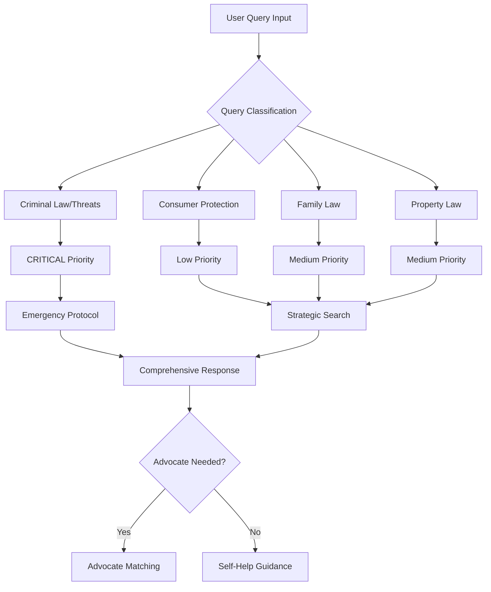

# Indian Kanoon Agentic RAG Integration

## Overview

This enhanced Indian Kanoon client implements an **Agentic RAG (Retrieval-Augmented Generation)** system that intelligently processes legal queries following a structured flow diagram. The system automatically classifies queries, assesses urgency, and applies appropriate search strategies to provide contextual legal guidance.

## 🚀 Key Features

### 🧠 Intelligent Query Classification
- **Automatic categorization** into Consumer Protection, Criminal Law, Family Law, Property Law, etc.
- **Urgency detection** with 4-level priority system (Low, Medium, High, Critical)
- **Context-aware routing** based on query type and urgency

### ⚡ Agentic Flow Implementation
Following the mermaid diagram specifications:
1. **Query Input** → **Classification** → **Urgency Assessment**
2. **Strategic Knowledge Retrieval** from Indian Kanoon API
3. **Context-aware Response Synthesis**
4. **Advocate Recommendation** for complex/urgent cases

### 🎯 Advanced Search Strategies
- **Dynamic search depth** based on query complexity
- **Multi-layered search** with primary, secondary, and legal-specific queries
- **Relevance scoring** and result prioritization
- **Court-specific filtering** for authoritative precedents

### 🚨 Emergency Protocol
- **Critical query detection** (threats, extortion, false cases)
- **Immediate action guidance** for urgent legal matters
- **Emergency contact information** and legal protections
- **Expedited search** with comprehensive result coverage

## 📊 Mermaid Flow Implementation



## 🛠️ Installation & Setup

### Prerequisites
- Python 3.8+
- Indian Kanoon API token
- Required packages: `asyncio`, `dataclasses`, `pathlib`, `json`, `re`

### Installation
```bash
# Clone or download the enhanced client
# Install dependencies
pip install -r requirements.txt

# Set your API token
export INDIAN_KANOON_API_TOKEN="your_token_here"  # Linux/Mac
$env:INDIAN_KANOON_API_TOKEN="your_token_here"    # Windows PowerShell
```

## 📚 Usage Examples

### Basic Agentic Search
```python
import asyncio
from indian_kanoon_client import agentic_legal_search

async def main():
    result = await agentic_legal_search(
        api_token="your_token",
        query="I bought a defective phone, what should I do?",
        user_context="Consumer protection issue"
    )
    
    print(f"Query Type: {result['classification']['query_type']}")
    print(f"Urgency: {result['classification']['urgency']}")
    print(f"Needs Counsel: {result['classification']['requires_legal_counsel']}")
    
    # Get legal guidance
    guidance = result['legal_guidance']
    print(f"Steps: {guidance['immediate_steps']}")
    print(f"Documents: {guidance['required_documents']}")
    print(f"Timeline: {guidance['timeline']}")

asyncio.run(main())
```

### Advanced Client Usage
```python
from indian_kanoon_client import create_indian_kanoon_client

async def advanced_usage():
    async with create_indian_kanoon_client("your_token", budget_limit=100.0) as client:
        # Perform agentic search
        result = await client.agentic_search(
            query="Property dispute with neighbor",
            user_context="Boundary encroachment issue"
        )
        
        # Get contextual documents
        if result['search_results']['results']:
            doc_id = result['search_results']['results'][0]['doc_id']
            contextual_doc = await client.get_contextual_document(
                doc_id, 
                classification=result['classification']
            )
            
            print(f"Document: {contextual_doc.title}")
            print(f"Legal Principles: {contextual_doc.legal_principles}")
            print(f"Case Type: {contextual_doc.case_type}")
```

### Emergency Query Handling
```python
# Critical queries trigger emergency protocols
emergency_query = "Wife threatened false rape case for dowry"

result = await agentic_legal_search("your_token", emergency_query)

if result['classification']['urgency'] == 'CRITICAL':
    emergency = result['emergency_response']
    print("🚨 URGENT LEGAL MATTER")
    print(f"Immediate Actions: {emergency['immediate_actions']}")
    print(f"Emergency Contacts: {emergency['emergency_contacts']}")
    print(f"Legal Protections: {emergency['legal_protections']}")
```

## 🔧 Configuration Options

### Query Classification Settings
```python
# Customize classification rules
classifier = QueryClassifier()
classifier.classification_rules[QueryType.CUSTOM] = {
    "keywords": ["custom", "keywords"],
    "legal_sections": ["Custom Act"],
    "urgency_indicators": ["urgent", "immediate"]
}
```

### Search Strategy Customization
```python
# Modify search strategies
search_engine = AgenticSearchEngine()
search_engine.search_strategies[QueryType.CONSUMER_PROTECTION].max_results = 20
search_engine.search_strategies[QueryType.CONSUMER_PROTECTION].search_depth = "comprehensive"
```

### Budget Management
```python
# Set budget limits and track usage
client = create_indian_kanoon_client(
    api_token="your_token",
    budget_limit=500.0  # Rs 500 limit
)

# Monitor budget
status = client.get_budget_status()
print(f"Budget Used: {status['budget_percentage_used']:.1f}%")
print(f"Remaining Searches: {status['insights']['remaining_searches']}")
```

## 🎯 Response Structure

### Agentic Search Response
```json
{
  "classification": {
    "query_type": "consumer_protection",
    "urgency": "MEDIUM",
    "confidence": 0.85,
    "requires_legal_counsel": false,
    "priority_score": 30
  },
  "search_results": {
    "total_found": 12,
    "results": [...],
    "search_strategy": {...}
  },
  "legal_guidance": {
    "immediate_steps": [...],
    "required_documents": [...],
    "timeline": "30-90 days",
    "relevant_laws": [...]
  },
  "recommendations": {
    "advocate_needed": false,
    "urgency_level": "MEDIUM",
    "next_actions": [...]
  },
  "budget_status": {...},
  "disclaimer": "Legal information disclaimer..."
}
```

### Emergency Response Structure
```json
{
  "classification": {
    "urgency": "CRITICAL",
    "requires_immediate_counsel": true
  },
  "emergency_response": {
    "immediate_actions": [...],
    "emergency_contacts": {...},
    "legal_protections": [...]
  },
  "advocate_recommendation": true,
  "disclaimer": "⚠️ URGENT LEGAL MATTER - Seek immediate counsel"
}
```

## 🧪 Testing

### Run Integration Tests
```bash
# Test without API token (classification only)
python test_agentic_integration.py

# Test with API token (full integration)
export INDIAN_KANOON_API_TOKEN="your_token"
python test_agentic_integration.py
```

### Test Specific Features
```python
# Test classification
from indian_kanoon_client import QueryClassifier
classifier = QueryClassifier()
result = classifier.classify_query("Your legal query here")

# Test search strategy
from indian_kanoon_client import AgenticSearchEngine
engine = AgenticSearchEngine()
strategy = engine.create_search_strategy(classification)
```

## 📊 Performance & Optimization

### Caching Strategy
- **Search results** cached by query + parameters
- **Document content** cached by doc_id + classification
- **Query classifications** cached by query hash
- **Automatic cache cleanup** on context exit

### Budget Optimization
- **Intelligent result limiting** based on query complexity
- **Strategic search depth** adjustment
- **Cost-aware document retrieval**
- **Usage analytics** and recommendations

### Error Handling
- **Graceful API failures** with fallback responses
- **Budget exhaustion** protection
- **Network timeout** handling
- **Invalid query** processing

## 🔐 Security & Privacy

### API Token Security
- **Environment variable** storage
- **No token logging** in production
- **Secure client initialization**

### Data Privacy
- **No query storage** on external servers
- **Local caching** only
- **Automatic cleanup** of sensitive data

## 🤝 Integration with Legal Assistant

### With Existing Legal Assistant
```python
# In your legal_assistant.py
from indian_kanoon_client import create_indian_kanoon_client

class SimpleLegalAssistant:
    def __init__(self):
        self.indian_kanoon_client = create_indian_kanoon_client(
            api_token=os.getenv('INDIAN_KANOON_API_TOKEN'),
            budget_limit=500.0
        )
    
    async def ask_question_with_agentic_search(self, question: str):
        # Use agentic search instead of basic search
        result = await self.indian_kanoon_client.agentic_search(question)
        
        # Process result with existing RAG system
        # ... rest of your implementation
```

### Streamlit Integration
```python
# In your streamlit_app.py
import streamlit as st
from indian_kanoon_client import agentic_legal_search

@st.cache_data
async def cached_agentic_search(query: str):
    return await agentic_legal_search(
        api_token=st.secrets["INDIAN_KANOON_API_TOKEN"],
        query=query
    )

# Use in your Streamlit app
if st.button("Get Legal Guidance"):
    result = await cached_agentic_search(user_query)
    
    # Display classification
    st.write(f"**Query Type:** {result['classification']['query_type']}")
    st.write(f"**Urgency:** {result['classification']['urgency']}")
    
    # Display guidance
    st.write("**Immediate Steps:**")
    for step in result['legal_guidance']['immediate_steps']:
        st.write(f"- {step}")
```

## 🛣️ Roadmap

### Immediate Enhancements
- [ ] **Advocate matching** system integration
- [ ] **Multi-language** query support
- [ ] **Voice input** processing
- [ ] **Document upload** and analysis

### Advanced Features
- [ ] **Machine learning** classification improvement
- [ ] **Predictive analytics** for case outcomes
- [ ] **Real-time legal updates** integration
- [ ] **Collaborative filtering** for similar cases

### Platform Integration
- [ ] **WhatsApp bot** integration
- [ ] **Mobile app** SDK
- [ ] **Web widget** for legal websites
- [ ] **API gateway** for third-party integrations

## 📞 Support & Contributing

### Support
- **Documentation**: This README and inline code comments
- **Testing**: Comprehensive test suite included
- **Examples**: Multiple usage examples provided

### Contributing
1. Fork the repository
2. Create feature branch (`git checkout -b feature/agentic-enhancement`)
3. Commit changes (`git commit -am 'Add agentic feature'`)
4. Push to branch (`git push origin feature/agentic-enhancement`)
5. Create Pull Request

## 📄 License

This project is licensed under the MIT License - see the LICENSE file for details.

## 🙏 Acknowledgments

- **Indian Kanoon** for providing the legal database API
- **LangChain** for RAG system inspiration
- **Mermaid** for flow diagram specifications
- **Legal community** for domain expertise

---

**⚠️ Legal Disclaimer**: This system provides legal information for educational purposes only and does not constitute legal advice. Users should consult with qualified legal professionals for specific legal guidance.
